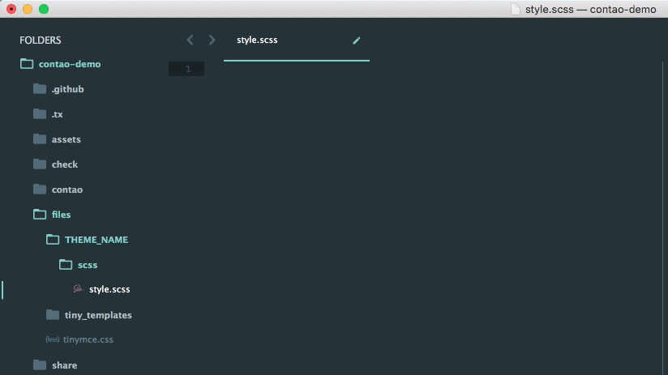

# Sublime Text Contao Front-End Snippets

A [Sublime Text](https://www.sublimetext.com/) snippet library for Contao Front-End Classes.
Compatible with Contao 4.2.X and 3.5.X.



## Installation

### [Package Control](https://packagecontrol.io/)

1. Run “Package Control: Install Package” command, find and install “Contao Front-End Snippets” plugin.
1. Restart Sublime Text Editor (if required).

### Git

1. Clone the repository into your Sublime Text 2 / 3 package directory. You can find your package directory by going to `Preferences > Browser Packages`.

```
git clone https://github.com/marcobiedermann/sublime-contao-front-end-snippets.git
```

### Download

1. Download the [.zip](https://github.com/marcobiedermann/sublime-contao-front-end-snippets/archive/master.zip) file and unzip it.
1. Move the content into your Sublime Text 2 / 3 package directory. You can find your package directory by going to `Preferences > Browser Packages`.

## Usage

Start typing `ce_`, `layout_` or `mod_` in CSS, [Less](http://lesscss.org/), [Sass](http://sass-lang.com/), [Scss](http://sass-lang.com/) or [Stylus](http://stylus-lang.com/) files and the autocomplete windows opens.

### Elements

| Element | Snippet code |
|---|---|
| Button | button |
| Enclosure | enclosure |
| Formbody | formbody |
| Image Container | image_container |
| Pagination | pagination |
| PDF Link | pdf_link |

### Content Elements

| Content Element | Snippet code |
|---|---|
| Accordion | ce_accordion |
| Code | ce_code |
| Download | ce_download |
| Downloads | ce_downloads |
| Form | ce_form |
| Gallery | ce_gallery |
| Headline | ce_headline |
| Hyperlink | ce_hyperlink |
| Image | ce_image |
| List | ce_list |
| Markdown | ce_markdown |
| Player | ce_player |
| Slider | ce_slider |
| Table | ce_table |
| Teaser | ce_teaser |
| Text | ce_text |
| Toplink | ce_toplink |
| YouTube | ce_youtube |

### Layout

| Layout | Snippet code |
|---|---|
| Wrapper | layout_wrapper |
| Header | layout_header |
| Container | layout_container |
| Main | layout_main |
| Left | layout_left |
| Right | layout_right |
| Footer | layout_footer |

### Modules

| Module | Snippet code |
|---|---|
| Article List | mod_articleList |
| Article | mod_article |
| Booknav | mod_booknav |
| Breadcrumb | mod_breadcrumb |
| Calendar | mod_calendar |
| Change Password | mod_changePassword |
| Close Account | mod_closeAccount |
| CustomNav | mod_customNav |
| Eventlist | mod_eventlist |
| Eventmenu | mod_eventmenu |
| Eventreader | mod_eventreader |
| FAQ List | mod_faqlist |
| FAQ Page | mod_faqpage |
| FAQ Reader | mod_faqreader |
| Listing | mod_listing |
| Login | mod_login |
| Lost Password | mod_lostPassword |
| Navigation | mod_navigation |
| Newsarchive | mod_newsarchive |
| Newsletter List | mod_newsletterList |
| Newsletter Reader | mod_newsletterReader |
| Newslist | mod_newslist |
| Newsmenu | mod_newsmenu |
| Newsreader | mod_newsreader |
| Personal Data | mod_personalData |
| Quicklink | mod_quicklink |
| Quicknav | mod_quicknav |
| Random Image | mod_randomImage |
| Registration | mod_registration |
| RSS Reader | mod_rssReader |
| Search | mod_search |
| Sitemap | mod_sitemap |
| Subscribe | mod_subscribe |
| Unsubscribe | mod_unsubscribe |

## Related Projects
* [Atom Contao Front-End Snippets](https://github.com/marcobiedermann/atom-contao-front-end-snippets)

## License

Sublime Text Contao Front-End Snippets Plugin is open-sourced software licensed under the [MIT license](https://opensource.org/licenses/MIT).
